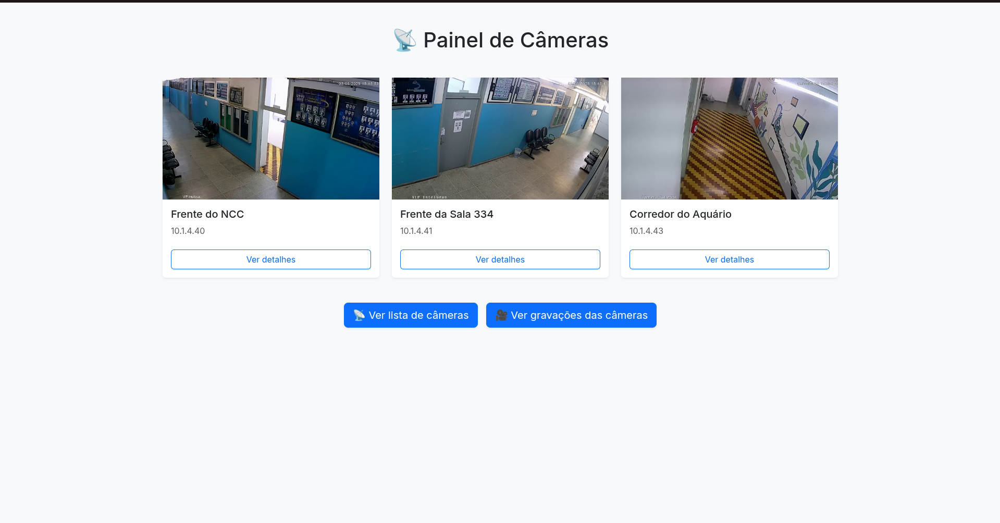
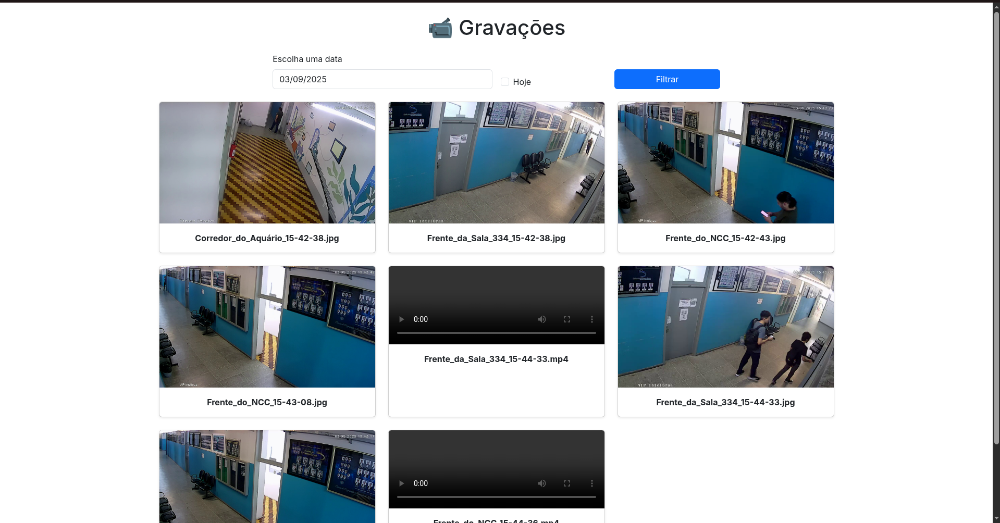

# 🎥 cameras-ncc


Sistema de monitoramento de câmeras do **Núcleo de Ciência da Computação (NCC)**.  
Captura fotos e vídeos automaticamente ao detectar movimento, com organização por data e hora, e visualização via navegador.

---

## 📸 Funcionalidades

- Captura automática de **fotos** e **vídeos** ao detectar movimento.
- Organização por **ano/mês/dia**.
- Gravação de vídeos curtos (configurável, ex.: 20s).
- Interface web para **visualização de gravações**.
- Ordenação das gravações pelo **horário de captura**.
- Suporte a múltiplas câmeras com nomes identificáveis.
- Vídeos leves compatíveis com **HTML5** (`.avi` ou `.mp4`).

---

## 🗂 Estrutura do Projeto

```
cameras-ncc/
│
├─ cameras/               
│   ├─ templates/cameras/
│   │   ├─ painel.html
│   │   └─ gravacoes.html
│   ├─ views.py
│   └─ models.py
│
├─ media/motion/YYYY/MM/DD/   
│   ├─ Camera_HH-MM-SS.jpg
│   └─ Camera_HH-MM-SS.avi
│
├─ manage.py
└─ README.md
```

---

## 💻 Instalação

1. Clone o repositório:
```bash
git clone https://github.com/ehodiogo/cameras-ncc.git
cd cameras-ncc
```

2. Crie um ambiente virtual:
```bash
python -m venv venv
source venv/bin/activate  # Linux/macOS
venv\Scripts\activate     # Windows
```

3. Instale as dependências:
```bash
pip install -r requirements.txt
```

4. Execute as migrações do Django:
```bash
python manage.py migrate
```

5. Execute o servidor de desenvolvimento:
```bash
python manage.py runserver
```

6. Acesse no navegador:
[http://127.0.0.1:8000/painel/](http://127.0.0.1:8000/painel/)

---

## ⚙ Configuração

No `settings.py`:

```python
MEDIA_URL = '/media/'
MEDIA_ROOT = BASE_DIR / 'media'
```

No script de captura:

```python
VIDEO_WIDTH = 640
VIDEO_HEIGHT = 480
VIDEO_FPS = 20
```

No `systemd` do servidor `cameras`:

```bash
su
sudo nano /etc/systemd/system/monitor_cameras.service
```

Cole o seguinte script no service:
```
[Unit]
Description=Monitoramento das câmeras do NCC via serviço de sistema
After=network.target

[Service]
WorkingDirectory=/home/cameras/cameras-ncc
ExecStart=/home/cameras/cameras-ncc/venv/bin/python /home/cameras/cameras-ncc/monitor_cameras.py
Restart=always
RestartSec=5
User=www-data
Environment="DJANGO_SETTINGS_MODULE=ncc.settings"

[Install]
WantedBy=multi-user.target
```

Reinicie o `daemon` e ative a função para rodar
```bash
sudo systemctl daemon-reload
sudo systemctl enable monitor_cameras
sudo systemctl start monitor_cameras
sudo systemctl status monitor_cameras

# CASO QUEIRA VER OS LOGS EM TEMPO REAL

sudo journalctl -u monitor_cameras.service
```

---

## 🖼 Tela do Painel

  
*Exemplo do painel web mostrando câmeras e gravações.*

  
*Exemplo da tela de gravações com fotos e vídeos ordenados.*

---

## ⬇ Download

Baixe o projeto como ZIP diretamente do GitHub:  
[📥 Download cameras-ncc.zip](https://github.com/seu-usuario/cameras-ncc/archive/refs/heads/main.zip)

---

## ⚠ Observações

- Vídeos gravados no formato `.avi` com codec **XVID**.
- Para produção, use WSGI/ASGI server (Gunicorn, Uvicorn).
- Requer navegador moderno com suporte **HTML5** para visualizar vídeos.

---

## 📝 Licença

Projeto livre para uso acadêmico. Modifique e adapte conforme necessidade.
